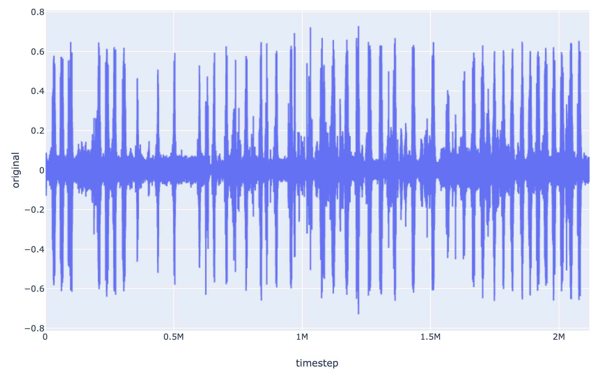

.. Python Timeseries Analyses documentation master file, created by
   sphinx-quickstart on Sun Oct 27 14:06:43 2019.
   You can adapt this file completely to your liking, but it should at least
   contain the root `toctree` directive.

Python Timeseries Analyses
======================================================

This documentation collates various timeseries analyses techniques.

|

.. toctree::
   :maxdepth: 1

   window
   featureengineering
   similarity
   model
