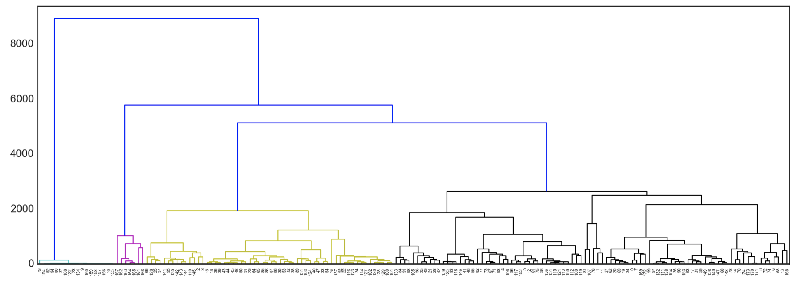

Modelling
==============

Agglomerative Clustering
-------------------------
Agglomerative Clustering is a type of *hierarchical clustering* technique 
used to build clusters from bottom up. 
Divisive Clustering is the opposite method of building clusters from top down, 
which is not available in sklearn.

There are 3 steps to this clustering.

1) Model the Data
*********************

.. code:: python

    from scipy.cluster.hierarchy import linkage, dendrogram
    Z = linkage(df, method='ward', metric='euclidean')

Two inputs are crucial the model:
 * method_ which refers to the method of calculating the distance between each clusters
 * metric_ the algorithm to calculate distance between each datapoint

.. _method: https://docs.scipy.org/doc/scipy/reference/generated/scipy.cluster.hierarchy.linkage.html#scipy.cluster.hierarchy.linkage
.. _metric: https://docs.scipy.org/doc/scipy/reference/generated/scipy.spatial.distance.pdist.html#scipy.spatial.distance.pdist

2) Plot the Dendrogram
*************************

.. code:: python

    from scipy.cluster.hierarchy import linkage, dendrogram
    plt.figure(figsize=(10, 5))
    dendrogram(Z, color_threshold=4000)

If we have a lot of datapoints, the plotted dendrogram will look overwhelmingly cluttered, like below.

The dendrogram can be further enhanced by 
 * adding title and axis labels
 * adding grids
 * truncating the bottom branches
 * labelling each cluster split distance
 * a horizontal line to investigate where would be an appropriate cutoff point

.. code:: python

    from scipy.cluster.hierarchy import linkage, dendrogram

    plt.style.use('seaborn-whitegrid')
    plt.figure(figsize=(8, 5))
    plt.title('Agglomerative Clustering Dendrogram')
    plt.xlabel('Clusters')
    plt.ylabel('Distance')

    Z = linkage(df, method='ward', metric='euclidean')
    # plot dendrogram
    ddata = dendrogram(Z, orientation='top',
                    truncate_mode='lastp', p=5,
                    labels=True, get_leaves=True,
                    show_leaf_counts=True,
                    show_contracted=True)

    # plot cluster points & distance labels
    for i, d, c in zip(ddata['icoord'], ddata['dcoord'], ddata['color_list']):
        x = sum(i[1:3])/2
        y = d[1]
        if y > 4:
            plt.plot(x, y, 'o', c=c, markeredgewidth=0)
            plt.annotate(int(y), (x, y), xytext=(0, -5),
                        textcoords='offset points',
                        va='top', ha='center', fontsize=9)

    # plot distance
    line = 1500
    plt.axhline(y=line, c='black', linestyle='--');

.. figure:: images/dendrogram2.png
    :width: 500px
    :align: center

3) Assign Cluster Labels
*************************

Finally, we assign a fixed cluster label to each datapoint, aka *flattening* the clusters.

.. code:: python

    from scipy.cluster.hierarchy import fcluster

    distance_threshold = 10
    y = fcluster(Z, distance_threshold, criterion='distance')

This can be done via various criteria_ , one of which is using a cut of distance.

.. _criterion: https://docs.scipy.org/doc/scipy/reference/generated/scipy.cluster.hierarchy.fcluster.html#scipy.cluster.hierarchy.fcluster