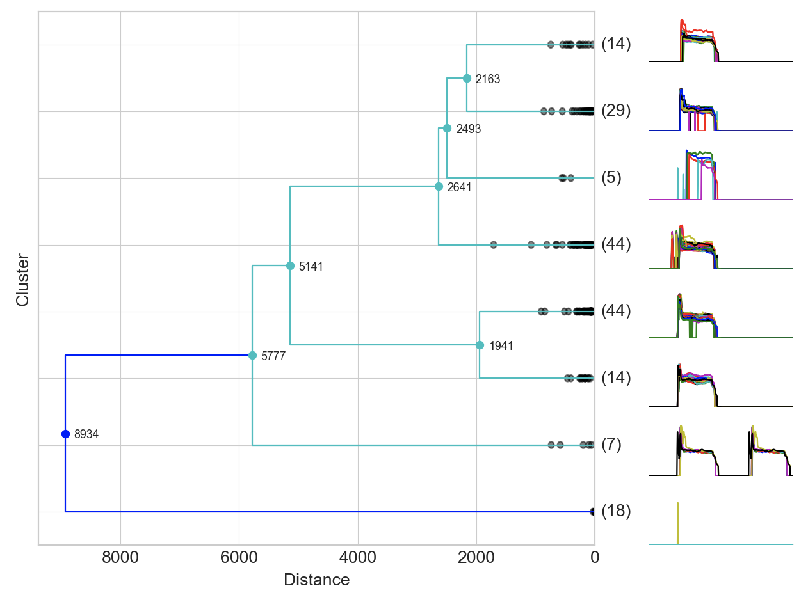

Modelling
==============

Agglomerative Clustering
-------------------------
Agglomerative Clustering is a type of *hierarchical clustering* technique 
used to build clusters from bottom up. 
Divisive Clustering is the opposite method of building clusters from top down, 
which is not available in sklearn. 
This technique allows direct timeseries windows to be clustered directly.

There are 4 steps to this clustering.

1) Model the Data
*********************

.. code:: python

    from scipy.cluster.hierarchy import linkage, dendrogram
    Z = linkage(df, method='ward', metric='euclidean')

Two inputs are crucial the model:
 * method_ which refers to the method of calculating the distance between each clusters
 * metric_ the algorithm to calculate distance between each datapoint

.. _method: https://docs.scipy.org/doc/scipy/reference/generated/scipy.cluster.hierarchy.linkage.html#scipy.cluster.hierarchy.linkage
.. _metric: https://docs.scipy.org/doc/scipy/reference/generated/scipy.spatial.distance.pdist.html#scipy.spatial.distance.pdist

2) Plot the Dendrogram
*************************

.. code:: python

    from scipy.cluster.hierarchy import linkage, dendrogram
    plt.figure(figsize=(10, 5))
    dendrogram(Z, color_threshold=4000)

If we have a lot of datapoints, the plotted dendrogram will look overwhelmingly cluttered, like below.
However, setting the ``color_threshold`` helps to classify the dendrogram better by color.

.. figure:: images/agglom1.png
    :width: 700px
    :align: center

The dendrogram can be further enhanced by 
 * adding title and axis labels
 * adding grids
 * trimming the bottom branches based on max. no. of clusters to display
 * labelling each cluster split distance
 * a horizontal line to investigate where would be an appropriate cutoff point

.. code:: python

    from scipy.cluster.hierarchy import linkage, dendrogram

    plt.style.use('seaborn-whitegrid')
    plt.figure(figsize=(8, 5))
    plt.title('Agglomerative Clustering Dendrogram')
    plt.xlabel('Clusters')
    plt.ylabel('Distance')

    # cluster
    Z = linkage(df, method='ward', metric='euclidean')

    # plot dendrogram
    ddata = dendrogram(Z, orientation='top',
                        truncate_mode='lastp', p=5,
                        labels=True, get_leaves=True,
                        show_leaf_counts=True,
                        show_contracted=True)

    # plot cluster points & distance labels
    limit = 4
    for i, d, c in zip(ddata['icoord'], ddata['dcoord'], ddata['color_list']):
        x = sum(i[1:3])/2
        y = d[1]
        if y > limit:
            plt.plot(x, y, 'o', c=c, markeredgewidth=0)
            plt.annotate(int(y), (x, y), xytext=(0, -5),
                        textcoords='offset points',
                        va='top', ha='center', fontsize=9)

    # plot distance
    line = 1500
    plt.axhline(y=line, c='black', linestyle='--');

.. figure:: images/agglom2.png
    :width: 500px
    :align: center

The labels in brackets is the number of datapoints that are clustered under each branch.

3) Assign Cluster Labels
*************************

Finally, we assign a fixed cluster label to each datapoint, aka *flattening* the clusters.

.. code:: python

    from scipy.cluster.hierarchy import fcluster

    # distance cutoff
    distance_threshold = 4000
    y = fcluster(Z, distance_threshold, criterion='distance')

    # max no. of clusters
    max_clusters = 5
    y = fcluster(Z, max_clusters, criterion='maxclust')

This can be done via various criteria_, e.g., using a cut off distance, or maximum no. of clusters.

.. _criteria: https://docs.scipy.org/doc/scipy/reference/generated/scipy.cluster.hierarchy.fcluster.html#scipy.cluster.hierarchy.fcluster

4) Plot Timeseries by Cluster
*****************************

If the dataset is in timseries windows, we can plot all the individual timeseries plots 
within their assigned clusters beside the dendrogram. Download the code from my 
github repository_. 

.. _repository: https://github.com/mapattacker/dendrogram-ts

.. code:: python
    
    from scipy.cluster.hierarchy import linkage, dendrogram, fcluster
    import matplotlib.pyplot as plt
    import matplotlib.gridspec as gridspec

    def add_distance(ddata, dist_threshold=None, fontsize=8):
        '''
        Description
        ------------
        Plot cluster points & distance labels in dendrogram

        Arguments
        ---------
        ddata: scipy dendrogram output
        dist_threshold: distance threshold where label will be drawn, if None, 1/10 from base leafs will not be labelled to prevent clustter
        fontsize: size of distance labels
        '''
        if dist_threshold==None:
            # add labels except for 1/10 from base leaf nodes
            dist_threshold = max([a for i in ddata['dcoord'] for a in i])/10
        for i, d, c in zip(ddata['icoord'], ddata['dcoord'], ddata['color_list']):
            y = sum(i[1:3])/2
            x = d[1]
            # only label above distance threshold
            if x > dist_threshold:
                plt.plot(x, y, 'o', c=c, markeredgewidth=0)
                plt.annotate(int(x), (x, y), xytext=(15, 3),
                            textcoords='offset points',
                            va='top', ha='center', fontsize=fontsize)

    def maxclust_draw(df, method, metric, max_cluster, ts_space=1):
        '''
        Description
        ------------
        Draw agglomerative clustering dendrogram based on maximum cluster criteron
        
        Arguments
        ---------
        df: dataframe or arrays of timeseries
        method: agglomerative clustering linkage method, e.g., 'ward'
        metric: distance metrics, e.g., 'euclidean'
        max_cluster: maximum cluster size to flatten cluster
        ts_space: horizontal space for timeseries graph to be plotted
        
        Output
        ------
        Plot dendrogram with timeseries graphs on the side
        '''
        
        # define gridspec space
        gs = gridspec.GridSpec(max_cluster,max_cluster)

        # add dendrogram to gridspec
        plt.subplot(gs[:, 0:max_cluster-ts_space])
        plt.xlabel('Distance')
        plt.ylabel('Cluster')

        # agglomerative clustering
        Z = linkage(df, method=method, metric=metric)
        ddata = dendrogram(Z, orientation='left',
                        truncate_mode='lastp', p=max_cluster,
                        labels=True, get_leaves=True,
                        show_leaf_counts=True,
                        show_contracted=True)
        
        # add distance labels in dendrogram
        add_distance(ddata)            

        # get cluster labels
        y = fcluster(Z, max_cluster, criterion='maxclust')
        y = pd.DataFrame(y,columns=['y'])

        # merge with original dataset
        dx=pd.concat([df.reset_index(drop=True), y],axis=1)

        # add timeseries graphs to gridspec
        for cluster in range(1,max_cluster+1):
            reverse_plot = max_cluster+1-cluster
            plt.subplot(gs[reverse_plot-1:reverse_plot,max_cluster-ts_space:max_cluster])
            plt.axis('off')
            for i in range(len(dx[dx['y']==cluster])):
                plt.plot(dx[dx['y']==cluster].T[:-1].iloc[:,i]);

        plt.tight_layout()

    plt.figure(figsize=(8,5));
    maxclust_draw(df.T, 'ward', 'euclidean', 5, 1)

