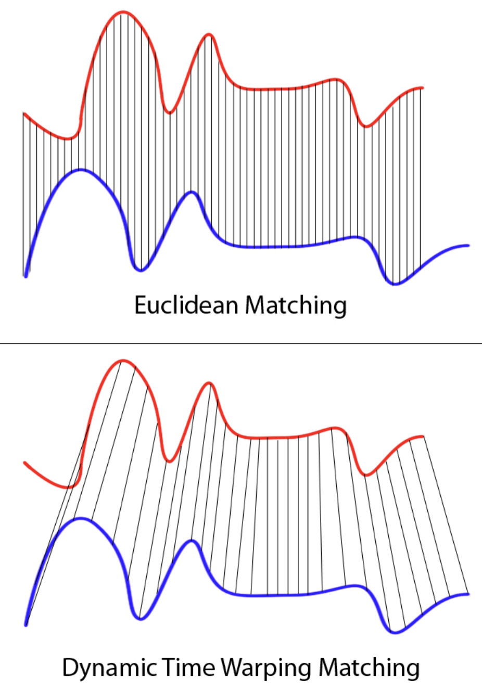

Similarity
============

DTW
----
If two time series are identical, but one is shifted slightly along the time axis, 
then Euclidean distance may consider them to be very different from each other. 
Dynamic Time Wrapping (DTW) was introduced to overcome this limitation and give 
intuitive distance measurements between time series by ignoring both global and 
local shifts in the time dimension.

    DataBricks Blog

|

.. code:: python

    import numpy as np
    from scipy.spatial.distance import euclidean
    from fastdtw import fastdtw

    x = np.array([[1,1], [2,2], [3,3], [4,4], [5,5]])
    y = np.array([[2,2], [3,3], [4,4]])
    distance, path = fastdtw(x, y, dist=euclidean)
    print(distance)

There are many variants of DTW. An example is to first normalize both signals before running DTW
so that the distance will mostly be shape, rather than amplitude related.

.. code:: python

    from scipy.stats import zscore
    from fastdtw import fastdtw

    sig1 = zscore(sig1)
    sig2 = zscore(sig2)
    distance, path = fastdtw(sig1, sig2, dist=euclidean)

    